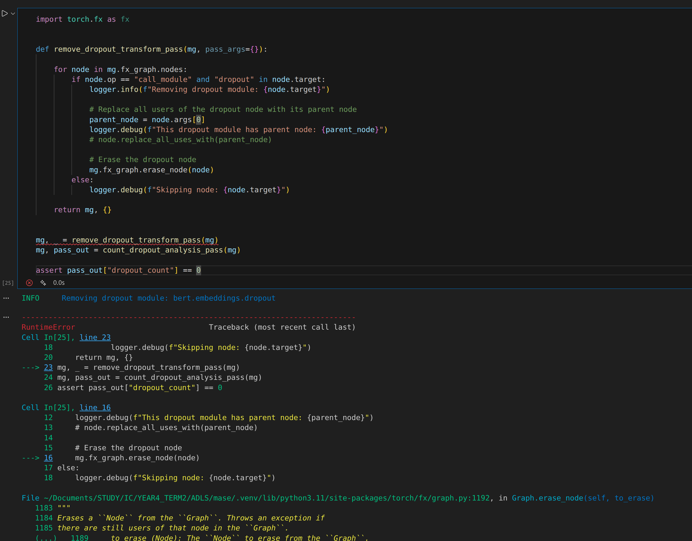
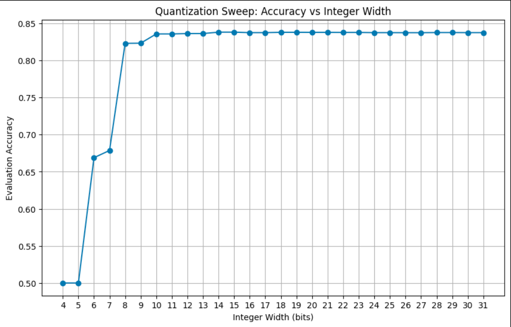
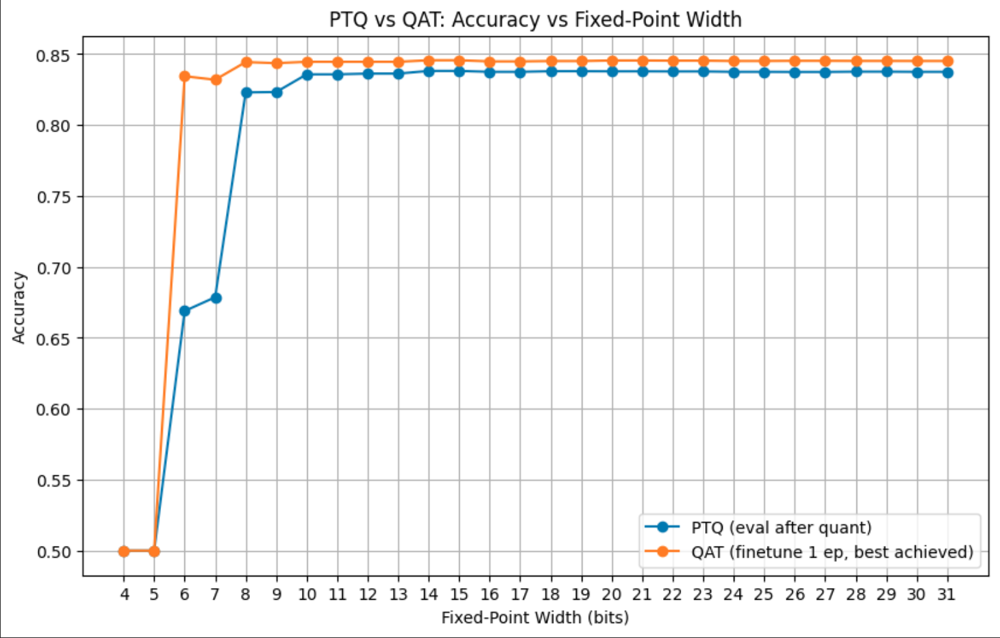
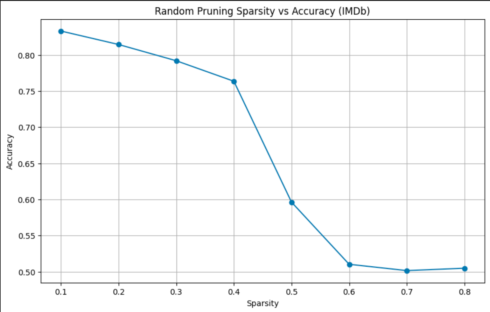
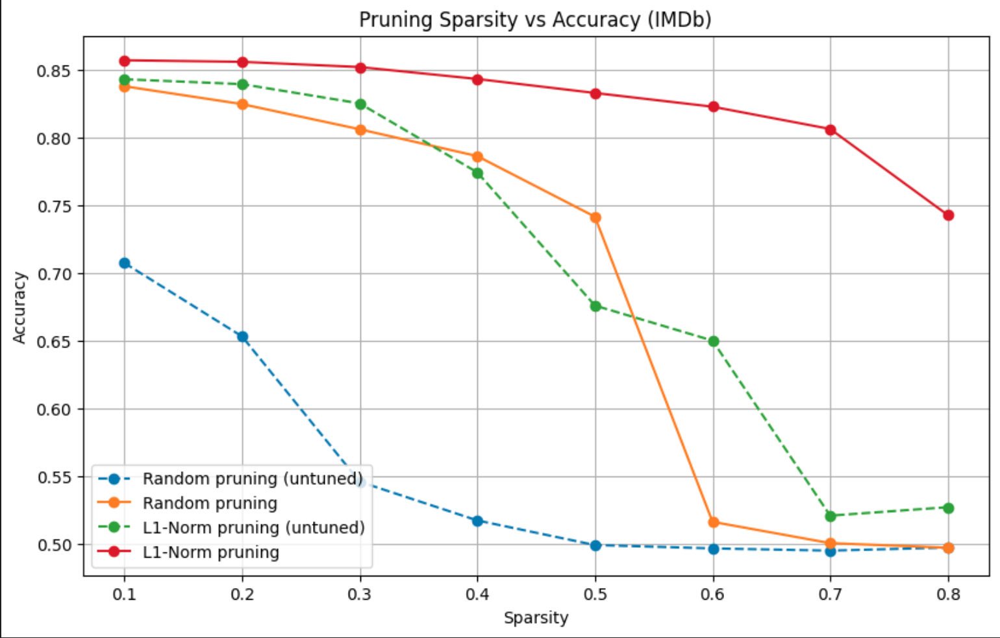
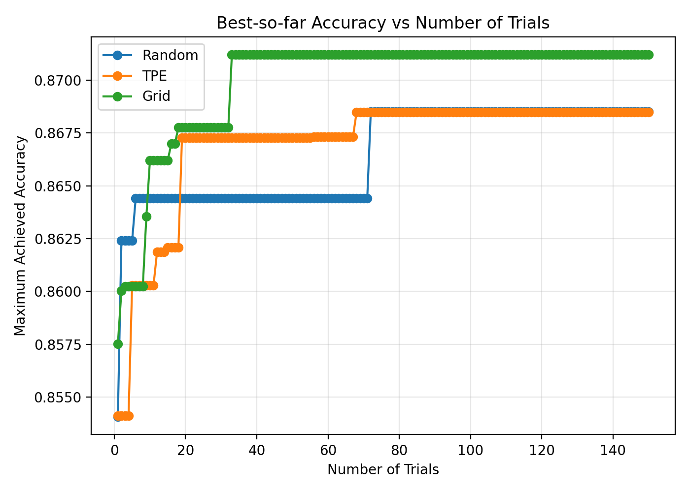
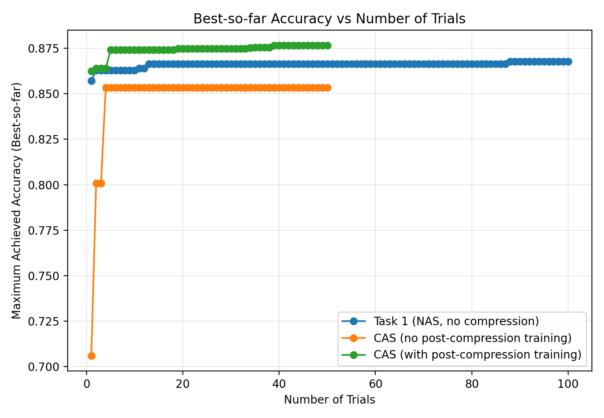
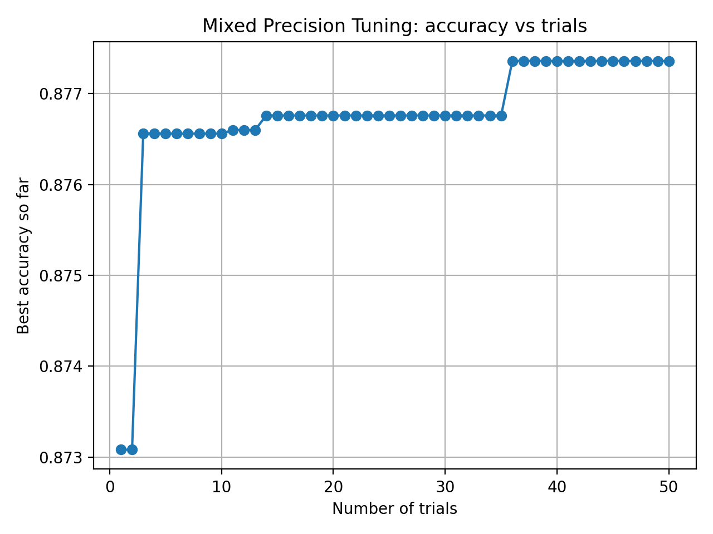
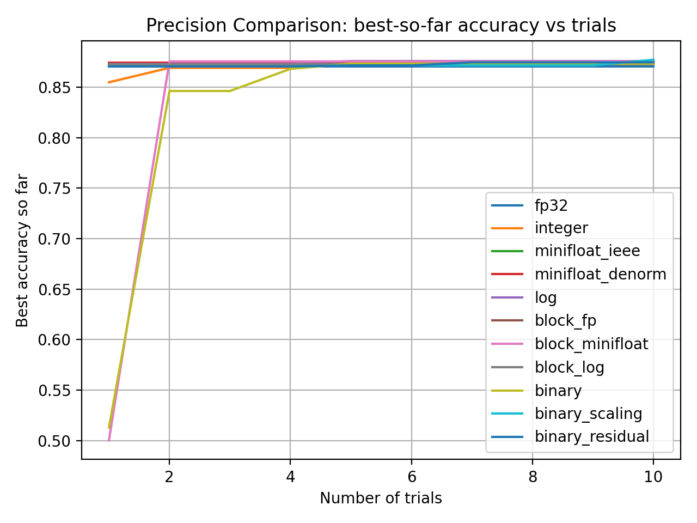
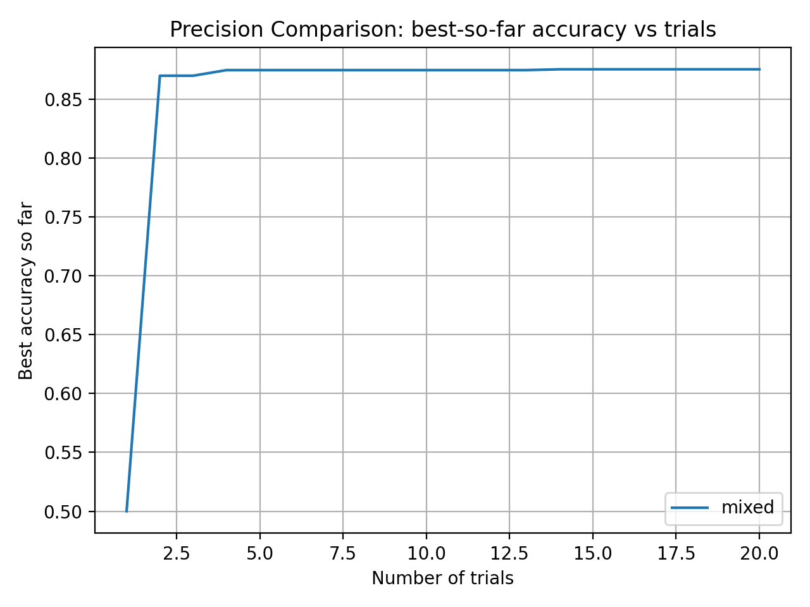

# Logbook

## Lab 0
### why fx?
- **High-level IR**: unlike `LLVM` or `MLIR`, `FX` offers a high-level representation of the computation which enables fast optimizations.

- **Pytorch native**: every operator in the FX graph correlates to a Python object or callable, meaning we can transform and optimize the graph, then simply regenerate the Python code required to run it. Unlike ONNX, there is no requirement for a dedicated runtime: all you need is Python.
### Bert mase graph output:
[link to the graph](./img/bert-base-uncased.svg)

### fx node types:
- **placeholder**: represents a function input, which can be a `Tensor` or another Python object.

- **get_attr**: retrieves a parameter from the Pytorch module hierarchy. `target` is the fully-qualified string name of the parameter’s position in the module hierarchy.

- **call_function**: applies a free function to some values. `target` is a handle to the Python callable. `args` and `kwargs` represent the arguments to the function, following the Python calling convention.

- **call_module**: applies a module in the module hierarchy’s `forward()` method with the given arguments. `target` is the fully-qualified string name of the module in the module hierarchy to call.

- **call_method**: calls a method on a value. `target` is the string name of the method to apply to the self argument.

- **output**: contains the output of the traced function in its args[0] attribute. This corresponds to the `return` statement in the Graph printout.
### `call_function` `call_module` and `call_method`
function -> any python callable functions
module -> torch.nn.module
method -> Tensor.methods

```
random_tensor = torch.randn(2, 2)

function_relu = torch.relu(random_tensor)
method_relu = random_tensor.relu()
module_relu = torch.nn.ReLU()(random_tensor)
```

### Task: 
Delete the call to `replace_all_uses_with` to verify that FX will report a RuntimeError.
**Result:**


### Task: 
Remove the `attention_mask` and `labels` arguments from the `hf_input_names` list and re-run the following cell. Use `mg.draw()` to visualize the graph in each case. Can you see any changes in the graph topology? Can you explain why this happens?

[click for full figure: 1 inputs](./img/lab0_tutorial_2_task_1_removed.svg)

[click for full figure: 3 inputs](./img/lab0_tutorial_2_task_1_full.svg)

**Answer:**

The aboved figure shows the 3 inputs graph will include a crossentropy module which allow the modole to output the loss by passing the `labels`.


The aboved figure shows the 3 inputs graph will include a input for the attention mask which will be usfull when **training in a batch**.

Therefore, I know that 3 input is required for traning, but 1 input is for inference.
## Lab 1

### Task 1:
In Tutorial 3, you quantized every Linear layer in the model to the provided configuration. Now, explore a range of fixed point widths from 4 to 32.

#### Section a
Plot a figure where the x-axis is the fixed point width and the y-axis is the highest achieved accuracy on the IMDb dataset, following the procedure in Tutorial 3.



#### Section b
Plot separate curves for PTQ and QAT at each precision to show the effect of post-quantization finetuning.



This done by this python script:
```python
import matplotlib.pyplot as plt
import chop.passes as passes

def quant_train_sweep(int_widths=range(4, 32),frac_rule=lambda w: w // 2,qat_epochs=1):

    ptq_accs = []
    qat_accs = []

    for int_width in int_widths:
        int_frac = frac_rule(int_width)
        print(f"\n=== width={int_width}, frac={int_frac} ===")

        # PTQ
        mg = MaseGraph.from_checkpoint(
            "/home/roy/Documents/STUDY/IC/YEAR4_TERM2/ADLS/mase/lab0/tutorial_2_lora"
        )
        trainer_ptq = get_trainer(
            model=mg.model,
            tokenized_dataset=dataset,
            tokenizer=tokenizer,
            evaluate_metric="accuracy",
        )

        print(f"[PTQ] Quantizing (width={int_width}, frac={int_frac}) then evaluate...")
        quantization_config_ptq = quant_config(int_width=int_width, int_frac_width=int_frac)
        mg_ptq, _ = passes.quantize_transform_pass(mg, pass_args=quantization_config_ptq)

        trainer_ptq.model = mg_ptq.model
        ptq_eval = trainer_ptq.evaluate()
        ptq_acc = ptq_eval["eval_accuracy"]
        print(f"[PTQ] eval_accuracy = {ptq_acc:.6f}")
        ptq_accs.append(ptq_acc)

        # QAT
        mg2 = MaseGraph.from_checkpoint(
            "/home/roy/Documents/STUDY/IC/YEAR4_TERM2/ADLS/mase/lab0/tutorial_2_lora"
        )
        trainer_qat = get_trainer(
            model=mg2.model,
            tokenized_dataset=dataset,
            tokenizer=tokenizer,
            evaluate_metric="accuracy",
        )

        print(f"[QAT] Quantizing then finetune for {qat_epochs} epoch(s)...")
        quantization_config_qat = quant_config(int_width=int_width, int_frac_width=int_frac)
        mg_qat, _ = passes.quantize_transform_pass(mg2, pass_args=quantization_config_qat)
        
        trainer_qat.model = mg_qat.model
        device = trainer_qat.args.device
        trainer_qat.model.to(device)
        trainer_qat.model.train()
        trainer_qat.train()


        qat_eval = trainer_qat.evaluate()
        best_acc = qat_eval["eval_accuracy"]

        print(f"[QAT] best achieved accuracy = {best_acc:.6f}")
        qat_accs.append(best_acc)

    plt.figure(figsize=(10, 6))
    plt.plot(list(int_widths), ptq_accs, marker="o", label="PTQ (eval after quant)")
    plt.plot(list(int_widths), qat_accs, marker="o", label=f"QAT (finetune {qat_epochs} ep, best achieved)")
    plt.title("PTQ vs QAT: Accuracy vs Fixed-Point Width")
    plt.xlabel("Fixed-Point Width (bits)")
    plt.ylabel("Accuracy")
    plt.xticks(list(int_widths))
    plt.grid(True)
    plt.legend()
    plt.show()

    return ptq_accs, qat_accs

```

### Task 2:
Take your best obtained model from Task 1 and rerun the pruning procedure, this time varying the sparsity from 0.1 to 0.9.

#### Section a
Plot a figure where the x-axis is the sparsity and the y-axis is the highest achieved accuracy on the IMDb dataset, following the procedure in Tutorial 4.


#### Section b
Plot separate curves for Random and L1-Norm methods to evaluate the effect of different pruning strategies.
**Result:**

We observed that the random pruning reduce the accuracy a lot without finetuning. But after finetuning the accuracy increase a lot but it will not exceed L1-pruning with finetuning.

The L1-pruning has the best result overall. Even without finetuning the accuracy dose not drop a lot, only when sparsity higher than 0.5, i.e. prune half of the weights. And L1-pruning can retain accuracy a lot after finetuning.

```python
import matplotlib.pyplot as plt
import torch
import chop.tools as tools
def pruning_config(sparsity, method="l1-norm", scope="local"):
    return {
        "weight": {
            "sparsity": sparsity,
            "method": method,
            "scope": scope,
        },
        "activation": {
            "sparsity": sparsity,
            "method": method,
            "scope": scope,
        },
    }

def get_best_accuracy(trainer):
    best_acc = None

    trainer.train()

    if hasattr(trainer, "state") and hasattr(trainer.state, "log_history"):
        for rec in trainer.state.log_history:
            if "eval_accuracy" in rec:
                best_acc = (
                    rec["eval_accuracy"]
                    if best_acc is None
                    else max(best_acc, rec["eval_accuracy"])
                )

    if best_acc is None:
        best_acc = trainer.evaluate()["accuracy"]

    return best_acc


def sparsity_sweep(batch_size=8, log_path="pruning_results.txt"):
    sparsity_list = [i / 10 for i in range(1, 9)]
    random_accuracies = []
    l1_accuracies = []

    with open(log_path, "a") as f:

        print("Random pruning sweep...")
        for sparsity in sparsity_list:
            print(f"[Random] sparsity={sparsity}")

            mg = MaseGraph.from_checkpoint(
                "/home/roy/Documents/STUDY/IC/YEAR4_TERM2/ADLS/mase/lab1/tutorial_3_qat"
            )
            mg, _ = passes.prune_transform_pass(
                mg, pass_args=pruning_config(sparsity, method="random")
            )

            trainer = tools.get_trainer(
                model=mg.model,
                tokenized_dataset=dataset,
                tokenizer=tokenizer,
                evaluate_metric="accuracy",
                num_train_epochs=5,
                train_batch_size=batch_size,
            )

            device = torch.device("cuda:0")
            trainer.model.to(device)
            trainer.train()

            acc = trainer.evaluate()["eval_accuracy"]
            random_accuracies.append(acc)

            f.write(f"random {sparsity:.1f} {acc:.6f}\n")
            f.flush()

        print("L1-Norm pruning sweep...")
        for sparsity in sparsity_list:
            print(f"[L1] sparsity={sparsity}")

            mg = MaseGraph.from_checkpoint(
                "/home/roy/Documents/STUDY/IC/YEAR4_TERM2/ADLS/mase/lab1/tutorial_3_qat"
            )
            mg, _ = passes.prune_transform_pass(
                mg, pass_args=pruning_config(sparsity, method="l1-norm")
            )

            trainer = tools.get_trainer(
                model=mg.model,
                tokenized_dataset=dataset,
                tokenizer=tokenizer,
                evaluate_metric="accuracy",
                num_train_epochs=5,
                train_batch_size=batch_size,
            )

            device = torch.device("cuda:0")
            trainer.model.to(device)
            trainer.train()

            acc = trainer.evaluate()["eval_accuracy"]
            l1_accuracies.append(acc)

            f.write(f"l1-norm {sparsity:.1f} {acc:.6f}\n")
            f.flush()

    plt.figure(figsize=(10, 6))
    plt.plot(sparsity_list, random_accuracies, marker="o", label="Random pruning")
    plt.plot(sparsity_list, l1_accuracies, marker="o", label="L1-Norm pruning")
    plt.xlabel("Sparsity")
    plt.ylabel("Accuracy")
    plt.title("Pruning Sparsity vs Accuracy (IMDb)")
    plt.grid(True)
    plt.legend()
    plt.show()

    return sparsity_list, random_accuracies, l1_accuracies

```
## Lab 2
### Task 1
Tutorial 5 shows how to use random search to find the optimal configuration of hyperparameters and layer choices for the Bert model.
#### Section a
Explore using the GridSampler and TPESampler in Optuna.

In file [nas.py](../lab2/nas.py)
#### Section b
Plot a figure that has the number of trials on the x axis, and the maximum achieved accuracy up to that point on the y axis. Plot one curve for each sampler to compare their performance.


From the graph, grid search achieves the highest final accuracy. However, grid search exhaustively evaluates all discretized points in the search space, which makes it impractical for large-scale neural architecture search (NAS). The strong performance observed here is highly dependent on the specific discretization and layout of the search space. Under an unfavorable alignment, grid search may only discover high-performing configurations at the end of the search. In principle, grid search exhibits a worst-case sample complexity of Θ(N).

Among the non-exhaustive methods, the TPE sampler achieves the best empirical performance. It reaches higher accuracy than random search within a small number of trials and consistently maintains this advantage throughout the optimization process. While TPE does not provide a better worst-case complexity guarantee and may degenerate to random search, it significantly improves sample efficiency in practice by exploiting the structure of the objective function.

Random search may occasionally sample high-performing configurations early due to randomness. However, in the worst case, it may require evaluating all possible configurations to identify the optimal solution. Therefore, its worst-case sample complexity is also Θ(N).


### Task 2
In Tutorial 5, NAS is used to find an optimal configuration of hyperparameters, then we use the CompressionPipeline in Mase to quantize and prune the model after search is finished. However, the final compressed model may not be optimal, since different model architectures may have different sensitivities to quantization and pruning. Ideally, we want to run a compression-aware search flow, where the quantization and pruning is considered in each trial.

#### Section a
```python
    def objective(trial: optuna.Trial):
        model = construct_model(trial)

        trainer_pre = get_trainer(
            model=model,
            tokenized_dataset=dataset,
            tokenizer=tokenizer,
            evaluate_metric="accuracy",
            num_train_epochs=PRE_COMPRESSION_EPOCHS,
        )
        trainer_pre.train()
        model = trainer_pre.model
        model.to("cpu")
        if torch.cuda.is_available():
            torch.cuda.empty_cache()
        mg = MaseGraph(
            model,
            hf_input_names=[
                "input_ids",
                "attention_mask",
                "labels",
            ],
        )
        pipe = CompressionPipeline()
        qcfg = copy.deepcopy(QUANTIZATION_CONFIG)
        pcfg = copy.deepcopy(PRUNING_CONFIG)
        mg, _ = pipe(
            mg,
            pass_args={
                "quantize_transform_pass": qcfg,
                "prune_transform_pass": pcfg,
            },
        )
        compressed_model = mg.model

        if post_compression_epochs > 0:
            trainer_post = get_trainer(
                model=compressed_model,
                tokenized_dataset=dataset,
                tokenizer=tokenizer,
                evaluate_metric="accuracy",
                num_train_epochs=post_compression_epochs,
            )
            trainer_post.train()
            eval_results = trainer_post.evaluate()
        else:
            trainer_eval = get_trainer(
                model=compressed_model,
                tokenized_dataset=dataset,
                tokenizer=tokenizer,
                evaluate_metric="accuracy",
                num_train_epochs=0,
            )
            eval_results = trainer_eval.evaluate()

        acc = float(eval_results["eval_accuracy"])

        return acc
```

#### Section b
Plot a new figure that has the number of trials on the x axis, and the maximum achieved accuracy up to that point on the y axis. There should be three curves: 1. the best performance from Task 1 (without compression), compression-aware search without post-compression training, and compression-aware search with post-compression training.

## Lab 3
### Task 1:
In Tutorial 6, all layers allocated to IntegerLinear are allocated the same width and fractional width. This is suboptimal, as different layers may have different sensitivities to quantization.

- a: Modify the code to allow different layers to have widths in the range [8, 16, 32] and fractional widths in the range [2, 4, 8]. Expose this choice as an additional hyperparameter for the Optuna sampler.
In file [mps.py](../lab3/mps.py)
- b: Run the search again, and plot a figure that has the number of trials on the x axis, and the maximum achieved accuracy up to that point on the y axis.


### Task 2:


The final best accuracy is `0.87564`.
The model arch is as follow:

```python
BertForSequenceClassification(
  (bert): BertModel(
    (embeddings): BertEmbeddings(
      (word_embeddings): Embedding(30522, 384, padding_idx=0)
      (position_embeddings): Embedding(512, 384)
      (token_type_embeddings): Embedding(2, 384)
      (LayerNorm): LayerNorm((384,), eps=1e-12, elementwise_affine=True)
      (dropout): Dropout(p=0.1, inplace=False)
    )
    (encoder): BertEncoder(
      (layer): ModuleList(
        (0): BertLayer(
          (attention): BertAttention(
            (self): BertSdpaSelfAttention(
              (query): Identity()
              (key): LinearBinaryScaling(in_features=384, out_features=384, bias=True)
              (value): LinearBinaryResidualSign(in_features=384, out_features=384, bias=True)
              (dropout): Dropout(p=0.1, inplace=False)
            )
            (output): BertSelfOutput(
              (dense): LinearBinary(in_features=384, out_features=384, bias=True)
              (LayerNorm): LayerNorm((384,), eps=1e-12, elementwise_affine=True)
              (dropout): Dropout(p=0.1, inplace=False)
            )
          )
          (intermediate): BertIntermediate(
            (dense): Linear(in_features=384, out_features=2048, bias=True)
            (intermediate_act_fn): GELUActivation()
          )
          (output): BertOutput(
            (dense): LinearBinary(in_features=2048, out_features=384, bias=True)
            (LayerNorm): LayerNorm((384,), eps=1e-12, elementwise_affine=True)
            (dropout): Dropout(p=0.1, inplace=False)
          )
        )
        (1): BertLayer(
          (attention): BertAttention(
            (self): BertSdpaSelfAttention(
              (query): Identity()
              (key): LinearMinifloatIEEE(in_features=384, out_features=384, bias=True)
              (value): Identity()
              (dropout): Dropout(p=0.1, inplace=False)
            )
            (output): BertSelfOutput(
              (dense): LinearLog(in_features=384, out_features=384, bias=True)
              (LayerNorm): LayerNorm((384,), eps=1e-12, elementwise_affine=True)
              (dropout): Dropout(p=0.1, inplace=False)
            )
          )
          (intermediate): BertIntermediate(
            (dense): Linear(in_features=384, out_features=2048, bias=True)
            (intermediate_act_fn): GELUActivation()
          )
          (output): BertOutput(
            (dense): LinearMinifloatIEEE(in_features=2048, out_features=384, bias=True)
            (LayerNorm): LayerNorm((384,), eps=1e-12, elementwise_affine=True)
            (dropout): Dropout(p=0.1, inplace=False)
          )
        )
      )
    )
    (pooler): BertPooler(
      (dense): LinearMinifloatDenorm(in_features=384, out_features=384, bias=True)
      (activation): Tanh()
    )
  )
  (dropout): Dropout(p=0.1, inplace=False)
  (classifier): LinearBinaryResidualSign(in_features=384, out_features=2, bias=True)
)


```

This is the plot of the search trails:


## Lab 4

### Task 1:

#### case: CPU

Original model: `0.9344 s`

Optimized model: `2.5768 s`

much slower! The possible reasons:

1) ResNet-18 is dominated by convolution layers, which are already highly optimized in PyTorch eager mode using oneDNN on CPU. TorchInductor primarily benefits models with heavy pointwise operations or fusion opportunities. For convolution-heavy models, the generated code often cannot outperform optimized vendor libraries.

2) My cpu is Intel i7-12700KF, which has multi cpus. Different execution paths may use different threading strategies. TorchInductor and eager mode can interact differently with OpenMP or oneDNN thread pools, sometimes leading to oversubscription or inefficient core utilization, which can degrade performance.

3) torch.compile is jit compilation. This intruduced compilation overhead for each bytecode executaion.

#### case: GPU

GPU Original model: `0.0411 s`

GPU Optimized model: `0.3081 s`

even much more slower! The possible reasons:
1) During compiling trail, I got some warning as output, this may be due to some overhead happed when the compile run the model.forward in first time, for example. looking for correct liberary and the low level apis (pynvml). And also during the backend searching or loading, the compile decide to used some bad backends.

2) Maybe there are other threads are using the GPU and the GPU is too busy to run the trail.

#### case: after warmup
After the two initila trail, I ran it again in notebook, the result is much better.

CPU Original model: `0.9321 s`

CPU Optimized model: `0.7850 s`

GPU Original model: `0.0214 s`

GPU Optimized model: `0.0213 s`


1) The possible case is that the model is being cache inside the device and the comiled path is also cached, no more jit graph break and recompiling happend in the runtime.

### Task 2

- a: rewrite the time_modle function and get_data function. And usd the same qkv for both cpu and gpu. Load to correct device before get_data call.
- b: The result is as follow:

CPU Original attention: `0.147642 s`

CPU Fused attention: `0.002589 s`

GPU Original attention: `0.000087 s`

GPU Fused attention: `0.000031 s`

The fusion dose increase the speed a lot. And compare GPU to CPU, the speed increases is limited but still double the speed. This may be the memory bendwidth on GPU is much larger than CPU and the speed up infered that the original attention is indeed limited by the memory bottelneck.

### Task 3

#### Section a
**Q:** How does MXINT8 benefit custom hardware if both the activation and weights in a linear layer are quantized to MXINT8?

**A:** The MXINT8 is much hardware friendly, in two aspect. One is integer computation  is simple in hardware and the other is it redecu the data size and so dose reduce the data throughput for a given memory bendwidth. 
- In hardware design aspect, the hardware the computation of FP number is much compicated and usually require multiple cycles to complete the computation which reduce the IPS. And large batch of FP computation will result in speed decreasing multiple times. How ever if we use MXINT to quantise FP numbers, the processing elements in tensor core or vector unit can usig integer MAC units which can finish computation in smaller cycles or even in one cycle other than multiple cycles in FP unit.
- And in dataflow aspect, if the memory width is 32 bits, the effective memory bendwidth will be 4 times larger.
#### Section b
**Q:** What is the purpose of the variable dont_need_abs and bias in the C++ for loop?

**A:** The FP in IEEE assume the mantissa has leading one, but MXINT does not guarantee. The dont_need_abs indicate if the leading one exits in mantissa. If it exit it is the same as FP IEEE, but if not, we need to removed the leading on introduced while using FP IEEE conversion.

#### Section c
**Q:** How does `cta_tiler` partition the data for copy?

**A:** the cta_tiler is used to prepare different section of memory i.e. a tile for different Compute Thread Arrays. While call local_tile, we need to pass the shape for each tile and the cta_tiler is the shape (BLK_M, BLK_K). With it, cta_coor will also being passed to local_tile, this is to indicate the cta location, that is which thread will used the tile. The local_tile dose not copy the data, but only return a Tensor view, i.e. a pointer to the memory section.

**Q:** How does layout_sX partition the threads in a threadblock for computation?
**A:** layout_sX defines a 2D mapping from threadIdx.x to (m, k) coordinates inside the CTA tile, so that each thread in the block is assigned ownership of exactly one (m, k) element in the shared-memory tile.

#### Section d
**Q:** Why the saved GPU memory is not exactly (32 - (4+8/32))/32 = 86.7% of the FP32 model?
**A:** 
```python
    for layer_name, layer in model.named_modules():
        if not isinstance(layer, torch.nn.Linear):
            continue
        if "classifier" in layer_name:
            continue
        layer.cuda()
        layer_q = QLinearPacked.build_from_linear(layer, group_size=mxint8_group_size)
        set_layer_by_name(model, layer_name, layer_q)
        del layer
        torch.cuda.empty_cache()
```
From this section we know that we are only quantize the torch.nn.Linear layer. There are other layer that are not being quantized for example encoder, pooling and classifer,